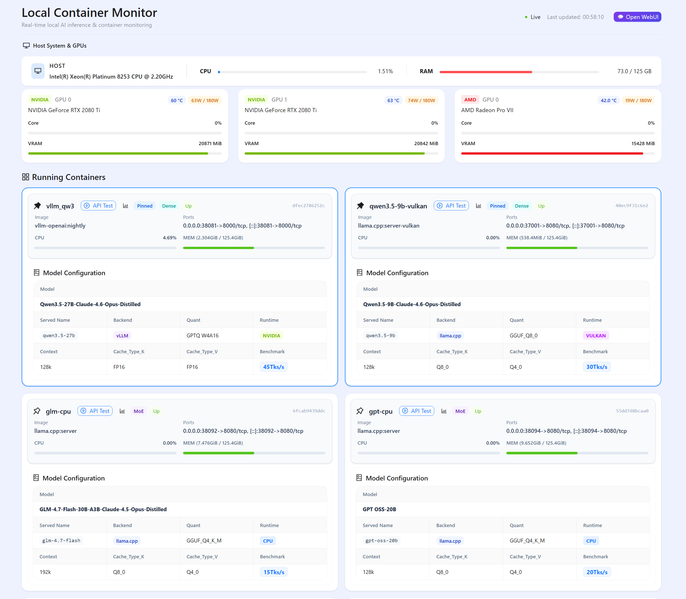
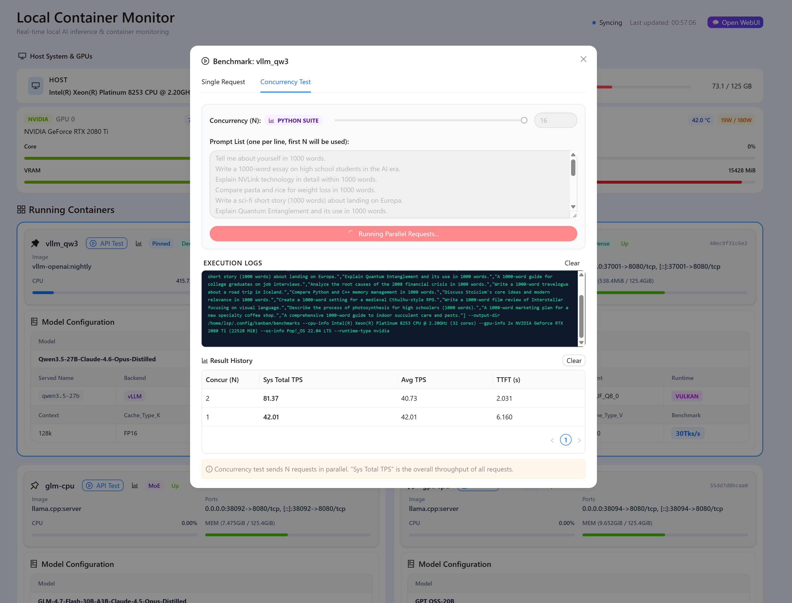
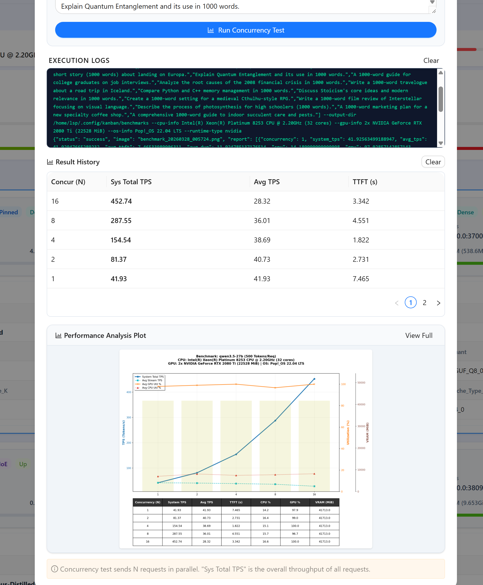
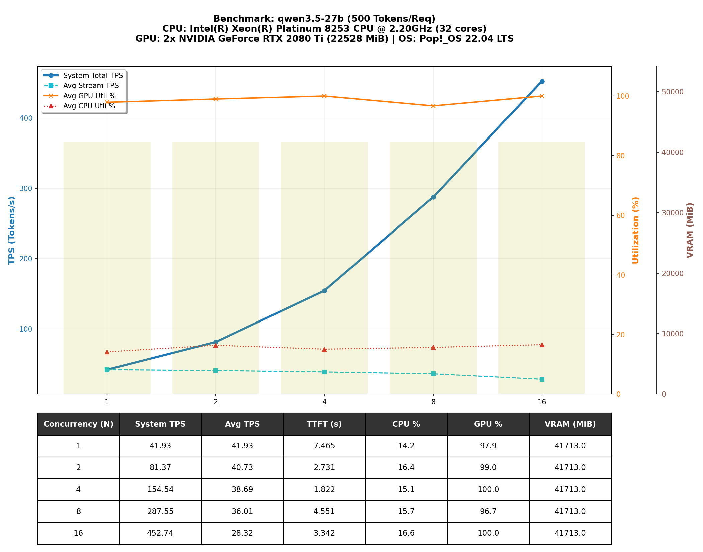
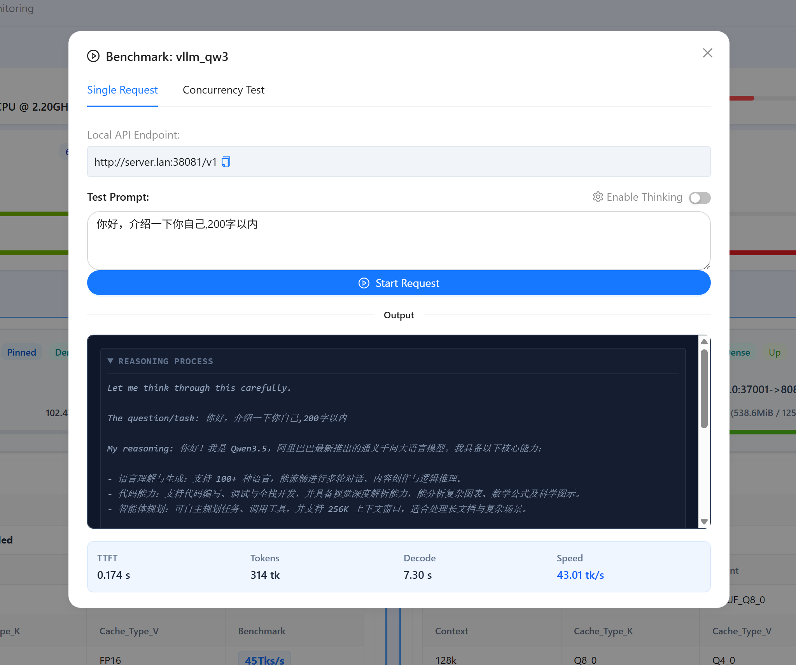

# Local Container Monitor

A high-performance, real-time dashboard for monitoring local AI inference containers (vLLM, llama.cpp, etc.) and system resources.



## 🌟 Features

### 1. Robust Hardware Monitoring
Track CPU, RAM, and GPU (NVIDIA/AMD/CPU) usage across all running containers in real-time. Automatically detects NVLink and multi-GPU setups.

### 2. Integrated Benchmark Suite
- **Concurrency Test**: Simulate high-load scenarios with parallel requests.
- **Python-Base Suite**: High-fidelity performance analysis using a dedicated Python utility.
- **Real-time Feedback**: Stream execution logs directly to the dashboard via SSE.
- **Automated Plotting**: Generates performance trend charts (TPS, Utilization, VRAM) automatically.





### 3. Model Testing & Reasoning
- **AI Test UI**: Instant chat interface for model verification.
- **Thinking Mode**: Native support for **Reasoning Process (CoT)** from Qwen, DeepSeek, and other models.
- **Deep Performance Metrics**: Real-time tracking of **TTFT**, **Decoding Speed (tokens/s)**, and total token count.



### 4. Advanced Configuration
- **Container Discovery**: Auto-maps container names to model metadata via `model-config.json`.
- **Backend Transparency**: Mode indicators show if you're using the optimized Python suite or the frontend fallback.
- **Systemd Integration**: Automated deployment as a persistent background service.

## 🚀 Quick Start

### 1. Prerequisites
- Docker & Docker Compose
- Node.js 20+
- Conda (optional, for Python benchmark suite)
- NVIDIA Drivers / ROCm (if using GPU acceleration)

### 2. Installation & Deployment
Clone the repository and run the automated deployment script:

```bash
chmod +x deploy.sh
./deploy.sh
```
The script will:
- Install dependencies
- Build the Next.js production bundle
- Install the `vllm-dashboard` systemd service
- Available at `http://localhost:3000`

## ⚙️ Configuration

The dashboard uses a priority-ordered configuration system (`~/.config/kanban/` > project dir).

### App Config (`~/.config/kanban/config.json`)
```json
{
  "openWebUIPort": 53000,
  "vllmApiKey": "vllm-test",
  "pythonPath": "/path/to/conda/env/bin/python",
  "benchmarkPlotDir": "~/.config/kanban/benchmarks"
}
```

### Model Config (`~/.config/kanban/model-config.json`)
```json
{
  "container-name": {
    "Model": "Qwen3.5-27B",
    "Served_Name": "qwen3.5-27b",
    "Backend": "vLLM",
    "Runtime": "nvidia"
  }
}
```

## 🛠 Tech Stack
- **Dashboard**: Next.js 15, Ant Design 5, Tailwind CSS
- **Benchmarking**: Python 3.11+, Matplotlib, OpenAI SDK
- **Monitoring**: Docker Stats API, Node.js OS/Child Process

## 📝 License
MIT
